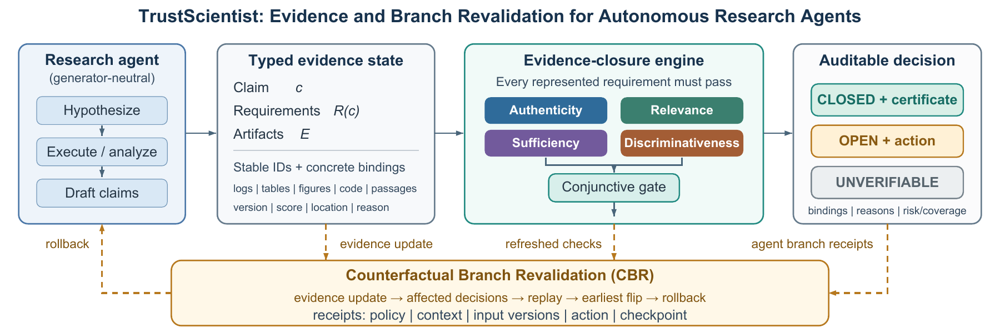
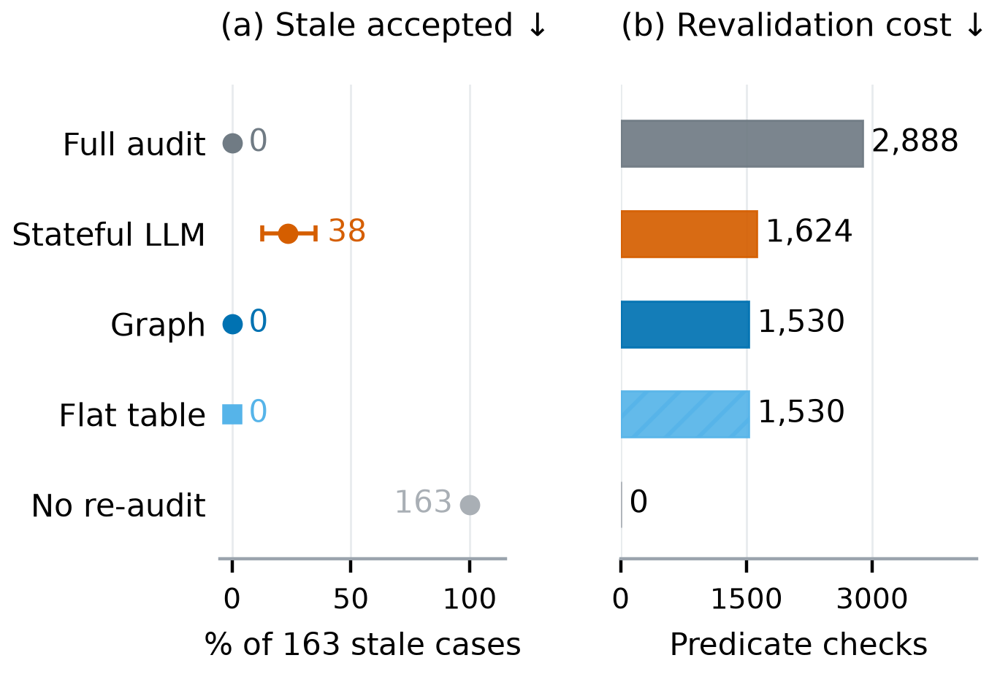
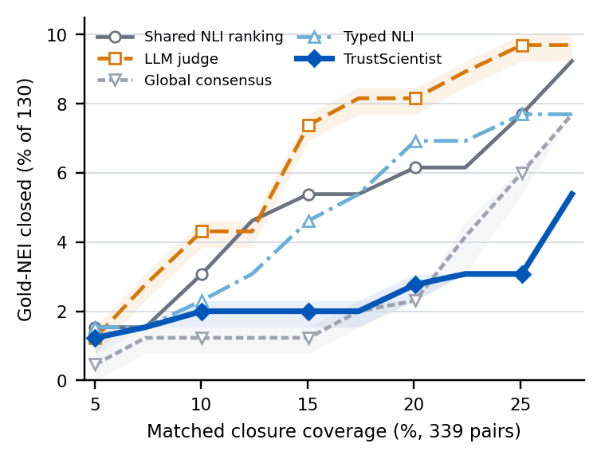
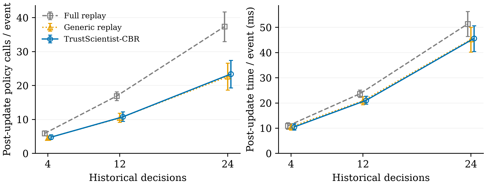

# TrustScientist: anonymous research artifact

Code, recorded results and reproducibility materials for the current AAMAS draft.

[Anonymous reviewer mirror](https://anonymous.4open.science/r/trustscientist-aamas2027-artifact-26CC/)
The original files are split into three archives to fit browser upload limits. The
core CBR engine is also directly viewable in `counterfactual_revalidation.py`.

## Paper figures

[Browse all paper figures](paper-figures/README.md). PDF, PNG and available SVG versions are directly accessible, with a source-to-manuscript manifest.







## Quick start

Download or clone this repository, then unpack the archives (checks SHA256):

```text
python unpack_artifact.py
```

Linux / Python 3.10+ is required for CBR file locking. Then run:

```text
python test_cbr.py
python run_branch_experiment.py prepare
python run_branch_experiment.py
python validate_branch_results.py
python analysis/recompute_recorded_results.py
```

Begin in a fresh extracted directory: experiment state persists between runs.
No model endpoint, API key or network is needed for these offline commands.
Install the plotting dependencies from `requirements-figures.txt` to redraw:

```text
python visualizations/scripts/plot_current_results.py --data-dir visualizations
```

## What is provided

- `artifact-code.zip`: portable implementation, recorded cases, four figure
  sources, frozen figure inputs, source provenance and the technical appendix.
- `artifact-cbr-inputs.zip`: archived witness bytes, controlled update cases and
  original 405-event branch results.
- `artifact-recorded-evidence.zip`: saved manifest, acquisition, semantic-gate,
  certificate, SciFact and fresh-execution records; archived model receipts.
- `TrustScientist_technical_appendix.pdf`: the updated 24-page appendix. The 22-page appendix inside the original archive records the earlier release.

The complete extracted README gives the data layout and protocol boundaries.
Recorded-output count recomputation is distinct from rerunning model inference.
Original request IDs, source hashes and redaction provenance are retained;
local author paths, API credentials and author Git history are excluded.

## Results and limits

CBR and full replay both find 254/254 earliest rollback points, with 382 vs
416 decision evaluations. Graph and flat certificate tracking tie: 1,530
checks vs 2,888 full checks, all with 0/163 stale accepts. Unguarded acquisition
and structured LLM match all 82 budget-four outcomes; failed historical
calibration produces 0/82 guarded closures. These work counts are not total
cost; no SOTA, independent human validation or unrestricted autonomous
scientific repair is claimed. Controlled branch updates use authored histories.
The new figure set preserves negative results and strong-baseline ties.

See `AI_ASSISTANCE.md` and `ANONYMIZATION.json` after extraction. Document
binaries from the acquisition corpus and full production source are omitted;
saved outputs, public source IDs and offline reproduction inputs remain.

## Executed longer-history study (7 October)

36 scripted research-analysis histories have 4,12 or 24 decisions, with actual public-data classifier fitting. Six paired controlled updates per history give 216 episodes. Full replay, generic dependency replay and CBR all recover 102/102 earliest rollback points and 216/216 consistent final outputs; each executes 135 continuation fits. No re-audit and certificate-only refresh yield 59/216 and 114/216 consistent episodes.

CBR uses 2,805 total post-update policy entries versus 4,334 full replay (35.3% reduction;95% cluster-bootstrap CI 32.2–38.6%). The matched generic comparator uses 2,709. Two order-balanced timing repetitions measure 10.3% lower CBR wall time than full (CI 9.3–11.2%); these repetitions reuse cases and exclude common history initialization. Policy-call savings are not total-dollar savings. Generic replay matches correctness and uses fewer calls; there is no CBR/ClaimGarden superiority claim.

```text
python unpack_trajectory.py
cd long_trajectory_artifact
python score_long.py
```

The content-addressed ZIP restores 70,225 byte-verified files, including actual primary workspaces, prediction arrays, receipts, quarantine, fit records and raw timing rows. Dependencies used:Python 3.11,NumPy 2.4.6,scikit-learn 1.9.0. Scoring independently recomputes 7,128 macro-F 1 values and parses saved products. To run fresh experiments, copy run_long.py,engine.py,score_long.py,PROTOCOL.md,design_lock.json to an empty directory,then run python run_long.py and python score_long.py. No model API key is needed. Timing workspaces remain in the original run; recorded timing rows and fit calls are included.

The new controlled histories are semi-real executed analyses,not original autonomous AutoResearchClaw histories. Four dataset families are reused;12 dataset–split clusters define bootstrap units. Five archived original runs contain no complete version-bound receipts,so natural-history replay correctness is still unestablished. Frozen scripted routing rules do not validate scientific judgment. Original archives and results remain unchanged.


