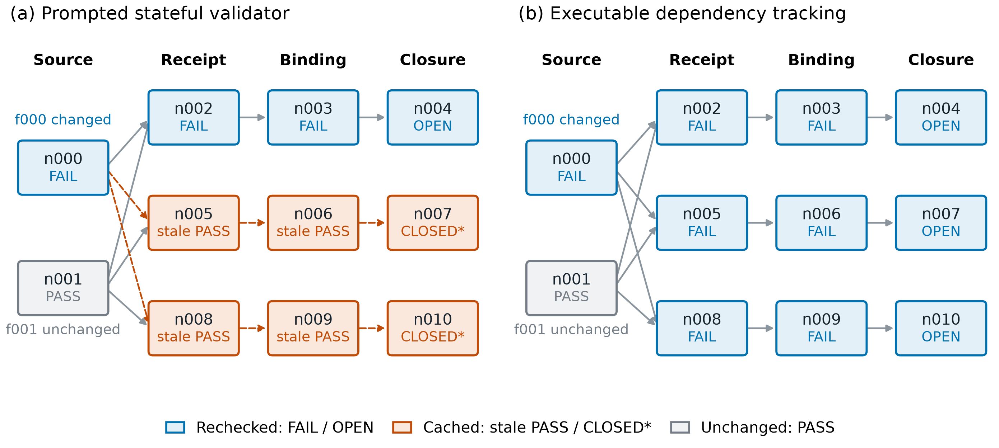
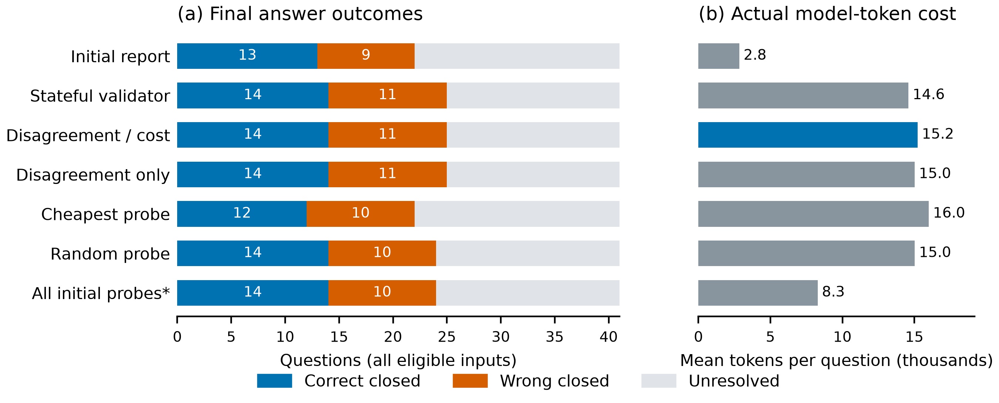
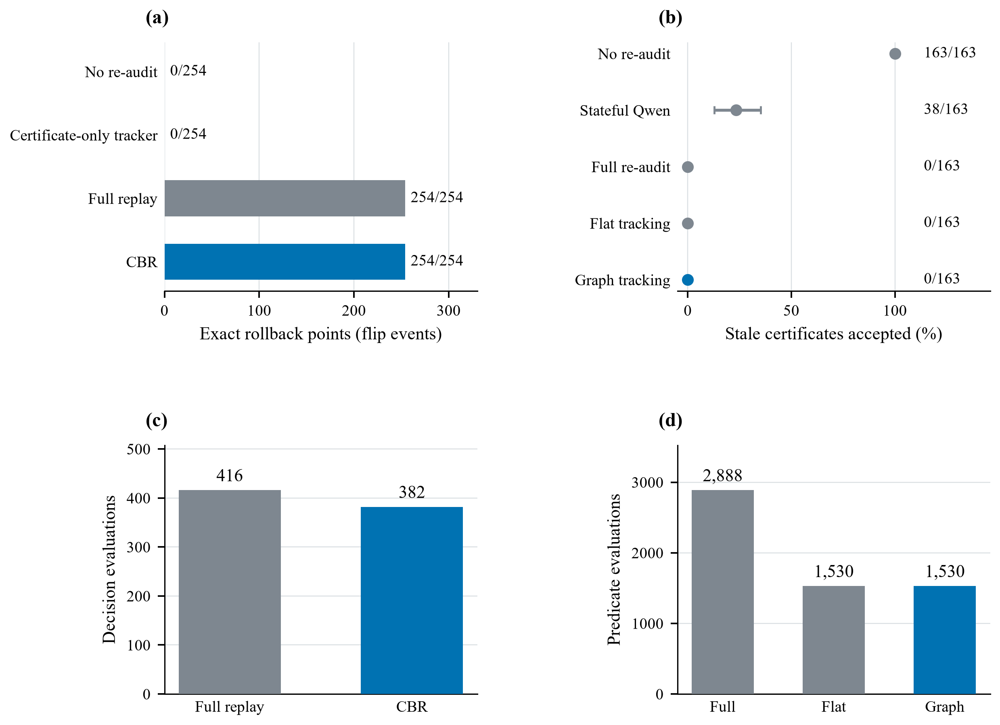
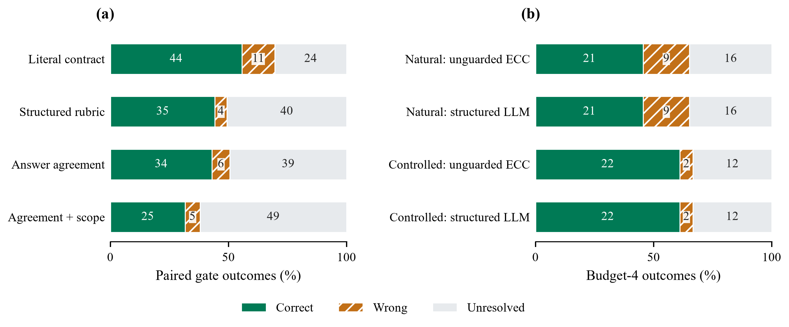
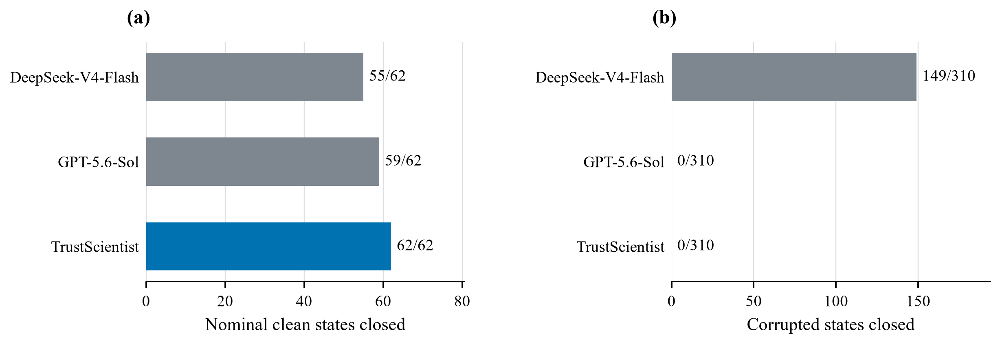
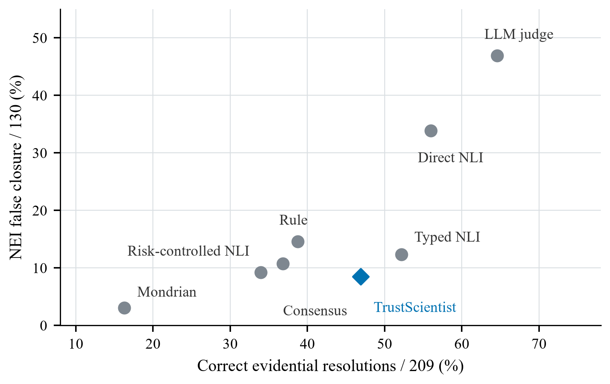

# Paper figures

Directly viewable figure files used by the current TrustScientist main paper and Technical Appendix. These files preserve the manuscript artwork and recorded-result figures; they add no experimental results.

| Figure | Used in | Files |
|---|---|---|
| Evidence and branch revalidation architecture | Main paper | [PDF](trustscientist_cbr_overview.pdf) · [PNG](trustscientist_cbr_overview.png) · [SVG](trustscientist_cbr_overview.svg) |
| Certificate revalidation comparison | Main paper | [PDF](fig_dynamic_outcomes.pdf) · [PNG](fig_dynamic_outcomes.png) · [SVG](fig_dynamic_outcomes.svg) |
| SciFact matched-coverage curves | Main paper | [PDF](fig_scifact_matched_coverage.pdf) · [PNG](fig_scifact_matched_coverage.png) |
| Shared-source certificate update | Technical appendix | [PDF](fig_dynamic_shared_source_trace.pdf) · [PNG](fig_dynamic_shared_source_trace.png) · [SVG](fig_dynamic_shared_source_trace.svg) |
| Evidence acquisition outcomes | Technical appendix | [PDF](fig_disambiguation_outcomes.pdf) · [PNG](fig_disambiguation_outcomes.png) · [SVG](fig_disambiguation_outcomes.svg) |
| Recorded branch and certificate maintenance | Technical appendix | [PDF](fig_current_maintenance.pdf) · [PNG](fig_current_maintenance.png) · [SVG](fig_current_maintenance.svg) |
| Recorded semantic and acquisition outcomes | Technical appendix | [PDF](fig_current_semantic_control.pdf) · [PNG](fig_current_semantic_control.png) · [SVG](fig_current_semantic_control.svg) |
| Matched-manifest compliance | Technical appendix | [PDF](fig_current_manifest.pdf) · [PNG](fig_current_manifest.png) · [SVG](fig_current_manifest.svg) |
| SciFact operating points | Technical appendix | [PDF](fig_current_scifact.pdf) · [PNG](fig_current_scifact.png) · [SVG](fig_current_scifact.svg) |
| Executed histories: work and timing | Technical appendix | [PDF](fig_trajectory_cost.pdf) · [PNG](fig_trajectory_cost.png) · [SVG](fig_trajectory_cost.svg) |

The manifest records the exact source asset, document, and SHA-256 digest for each file.

## Figure gallery

### Evidence and branch revalidation architecture

### Certificate revalidation comparison

### SciFact matched-coverage curves

### Shared-source certificate update

### Evidence acquisition outcomes

### Recorded branch and certificate maintenance

### Recorded semantic and acquisition outcomes

### Matched-manifest compliance

### SciFact operating points

### Executed histories: work and timing

